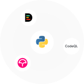
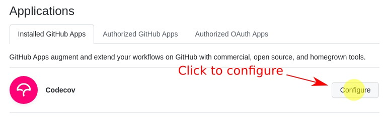
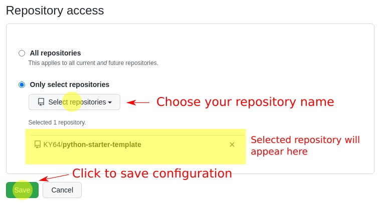
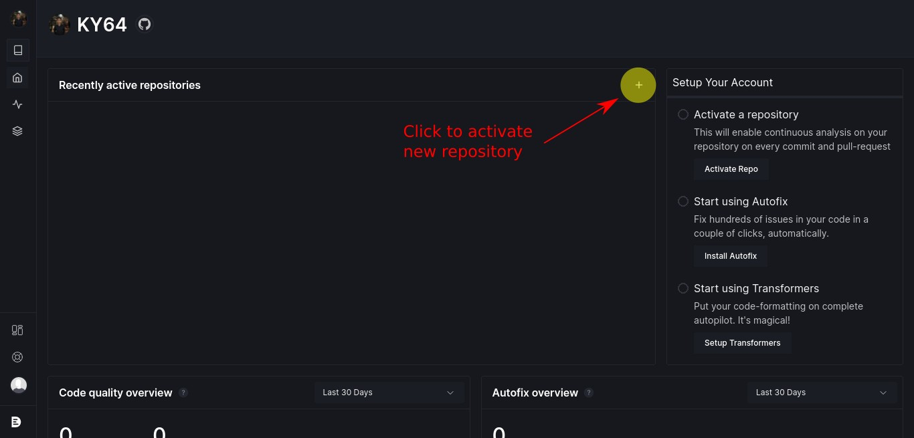
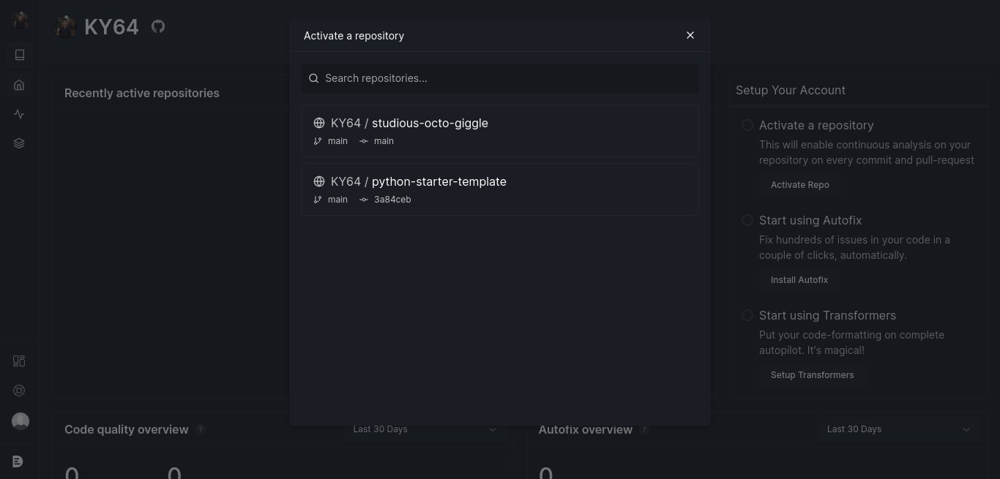
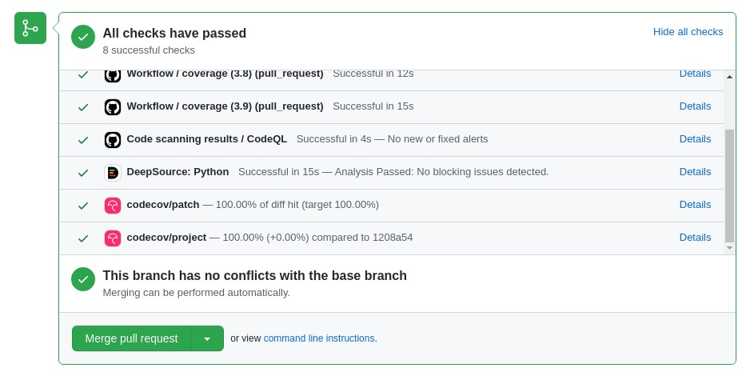

<div align="center">
	<h1> Python Starter Template </h1>
	<h2> with
    <a href="https://codecov.io" target="_blank">Codecov</a>,
    <a href="https://codeql.github.com" target="_blank">CodeQL</a>,
    and
    <a href="https://deepsource.io" target="_blank">DeepSource</a>
    included
  </h2>
	<br />
	
	<br />
	<br />
</div>

Start developing Python app right away without any hassle to install Github Apps or configure Github Action. Every pull request to the `main` branch will be analyzed by **Codecov** for checking test coverage, **CodeQL** for scanning vulnerabilities, and reviewed by **DeepSource**.

## How To Use

Follow the steps below to use this template

### 1. Install Github Apps

Install the required Github Apps from Marketplace (skip this part if it's already installed):

- [Install Codecov](https://github.com/marketplace/codecov)
- [Install DeepSource](https://github.com/marketplace/deepsource-io)

> No need to install **CodeQL** as it's already integrated with Github

### 2. Use The Template

Click **[Use This Template](https://github.com/KY64/python-starter-template/generate)** on repository page

### 3. Configure Apps

#### Permission

Since the apps may not work properly when you use this template, it may be because the apps don't have permission to access it. Here's how to configure it:

1. Go to [applications settings](https://github.com/settings/installations)
2. Click **Configure** button on the required app



3. On "Repository Access" section, there are two options you can choose, if you check **All repositories** then skip this step. Otherwise, see the figure below:



> These steps are applied for configuring both Codecov and DeepSource

#### DeepSource

If DeepSource is not triggered whenever you make a pull request, follow the steps below:

1. Login to [DeepSource dashboard](https://deepsource.io/login)
2. Activate your repository by clicking **+** button like the figure below:



3. Then, a list of repository will appear. Choose the one you want to use. The figure below is just an example



4. Click **I've added deepsource.toml, activate repo** button since the _.deepsource.toml_ file already exists in the repository


### 4. Create A Pull Request

We're all set, create a pull request to test whether the apps working. The result should look like the figure below:



## Project Structure

```
├── .deepsource.toml
├── .github
│   ├── codecov.yml
│   └── workflows
│       └── workflow.yml
├── LICENSE
├── README.md
├── logo.svg
├── requirements.txt
├── src
│   └── main.py
└── test
    ├── __init__.py
    └── test_main.py
```

- **.deepsource.toml**: required file for DeepSource configuration
- **.github**: directory for github workflow configuration
- **codecov.yml**: Codecov file configuration
- **workflow.yml**: Github Workflow configuration
- **LICENSE**: repository license
- **README.md**: description about this repository
- **logo.svg**: logo used by this repository
- **requirements.txt**: list of required python package
- **src**: directory for project source code
- **main.py**: a simple python program
- **test**: directory for storing test files
- **\_\_init\_\_.py**: required file to treat this directory as module
- **test_main.py**: test file for main.py


